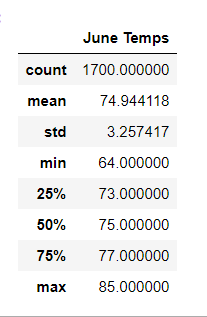
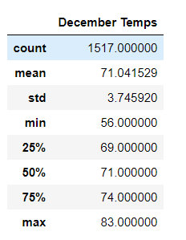

# Surfs Up

## Overview
The purpose of this analysis is to find out if Oahu is really a good place to open a surf and ice cream shop, based on temperatures in June and December. 

To do this, I used Python, Pandas, and SQL Alchemy. My input file was a SQL Lite file containing weather information.
## Results
Here is the result from the analyses (all temperatures are in Fahrenheit). See corresponding images.
- **June**
  - The average temperature is 74 degrees.
  - The low is 64 degrees, and the high is 85 degrees.
  - The standard deviation was low, meaning the data points are all close to the average of 74 degrees.
  
- **December**
  - The average temperature is 71 degrees.
  - The low is 56 degrees, and the high is 83 degrees.
  - The standard deviation was low, meaning the data points are all close to the average of 71 degrees.
  

## Summary
The analysis showed that temperatures are very moderate in Oahu for both June and December. December is just a little cooler. It seems that people could both surf and eat ice cream in both months. 

We know that Oahu has a rainy season, and it's unlikely that people will visit the shop on those days. To find the number of days in which there will be little to no sales, these additional queries could be run:
- Find the number of days it rained in June and the number of days it rained in December.
- Find the rainfall amount for the month of June and the rainfall amount for the month of December.

